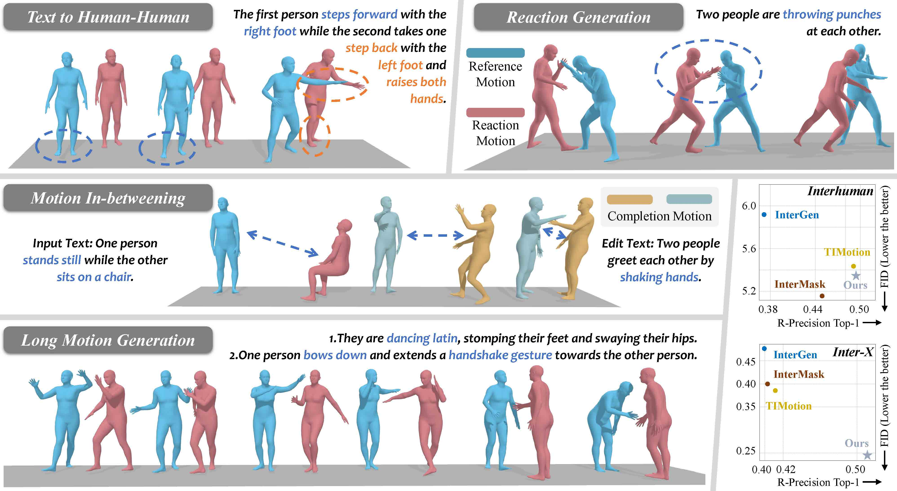

# InterDist: Generating Distance-Aware Human-to-Human Interaction Motions From Text Guidance

### [Paper](https://ieeexplore.ieee.org/document/11342399)  |  [InterHuman Dataset](https://drive.google.com/drive/folders/1oyozJ4E7Sqgsr7Q747Na35tWo5CjNYk3?usp=sharing) | [Inter-X Dataset](https://github.com/liangxuy/Inter-X)




If you find our work useful in your research, please consider citing:

```
@article{zhang2026interdist,
    author={Zhang, Jia-Qi and Wang, Jia-Jun and Zhang, Fang-Lue and Wang, Miao},
    journal={IEEE Transactions on Visualization and Computer Graphics}, 
    title={Generating Distance-Aware Human-to-Human Interaction Motions From Text Guidance}, 
    year={2026},
    volume={32},
    number={3},
    pages={2615-2627},
    doi={10.1109/TVCG.2026.3651382},
}
```

<!-- ---------------------------------------------------------------------- -->

## :round_pushpin: Preparation

<details>

### 1. Setup Environment
```
conda env create -f environment.yml
conda activate t2m
```
The code was tested on Python 3.9.19 and PyTorch 2.3.1 with CUDA 12.1. You may need to adjust the versions of some packages in `environment.yml` according to your setup.


### 2. Get Data

#### InterHuman
Follow the instructions on the [InterGen github repo](https://github.com/tr3e/InterGen/tree/master?tab=readme-ov-file#2-get-data) to download the InterHuman dataset and place it in the `./data/InterHuman/` foler and unzip the `motions_processed.zip` archive such that the directory structure looks like:
```
./data
├── InterHuman
    ├── annots
    ├── checkpoints
        ├── ViT-L-14-336px.pt
        └── intergen.ckpt
    ├── eval_model
        ├── eval_model.yaml
        └── interclip.ckpt
    ├── motions
    ├── motions_processed
    ├── split
    └── LICENSE.md
```

**For InterHuman Evaluation Models**
Also download the corresponding evaluation model and place it in the `./data/InterHuman/checkpoints/` directory.

If there is no ignore_list.txt after downloading the InterHuman dataset, you can copy the `ignore_list.txt` from the `./data/` folder into the `./data/InterHuman/split/` folder.


#### Inter-X
Follow the intstructions on the [Inter-X github repo](https://github.com/liangxuy/Inter-X?tab=readme-ov-file#dataset-download) to download the Inter-X dataset and place it in the `./data/Inter-X_Dataset` folder and unzip the `processed/texts_processed.tar.gz` archive, such that the directory structure looks like:
```
./data
├── InterX
    ├── annots
    ├── misc
    ├── processed
        ├── glove
        ├── motions
        ├── texts_processed
        └── inter-x.h5
    ├── splits
    ├── text2motion
        └── checkpoints
    └── LICENSE.md
```

#### Download SMPL-X (Only for Inter-X)
You need to download the [SMPL-X models](https://smpl-x.is.tue.mpg.de/) and then place them under `./data/body_models/smplx/`.

```
├── SMPLX_FEMALE.npz
├── SMPLX_FEMALE.pkl
├── SMPLX_MALE.npz
├── SMPLX_MALE.pkl
├── SMPLX_NEUTRAL.npz
├── SMPLX_NEUTRAL.pkl
└── SMPLX_NEUTRAL_2020.npz
```


### 3. Data preprocessing


This step requires extracting two separate motion sequences and an interaction distance sequence from the original two-person motion. 

No preprocessing is needed for the InterHuman dataset because its processing pipeline already includes extraction of the two separate motion sequences; you only need to extract the intermediate processing results when loading the dataset. Run the following script to preprocess the Inter-X dataset to obtain the corresponding separate motion sequences and interaction distance sequence:

```
python data/prepare_dataset_interx.py
```

After running, the processed two-person motion data will be saved in the `./data/InterX/processed/motions_norm/` folder.


### 4. Download Pre-trained Models

The following script will download pre-trained model checkpoints for both the **VQ-VAE** and **InterDist Transformer** on both the **InterHuman** and **Inter-X** datasets.
```
bash data/download_models.sh
```

</details>


## :space_invader: Train


### Train VQ-VAE
#### On InterHuman dataset
``` 
python train_vq.py --gpu_id 0 --dataname InterHuman \
    --lr 2e-4 --total-iter 100000 --lr-scheduler 70000 --ex_loss \
    --exp_name interh_vq_model

```
#### On Inter-X dataset
```
python train_vq.py --gpu_id 3 --dataname InterX \
    --lr 1e-4 --total-iter 150000 --lr-scheduler 120000 --ex_loss \
    --exp_name inter_x_vq_model
```


### Train InterDist
#### On InterHuman dataset
```
python train_t2m.py --gpu_id 3 --dataname InterHuman --lr-scheduler 60000 \
    --exp_name interh_t2m_model \
    --vq_model_pth checkpoints/interh_vq_model.pth
```
#### On Inter-X dataset
```
python train_t2m.py --gpu_id 2 --dataname InterX --lr-scheduler 50000 \
    --exp_name inter_x_t2m_model \
    --vq_model_pth --vq_model_pth checkpoints/inter_x_vq_model.pth
    
```


## :book: Evaluation


### Evaluate VQ-VAE Reconstruction:
InterHuman:
```
python eval_vq.py --gpu_id 2 --dataname InterHuman --vq_model_pth checkpoints/interh_vq_model.pth
```
Inter-X:
```
python eval_vq.py --gpu_id 3 --dataname InterX --vq_model_pth checkpoints/inter_x_vq_model.pth

```


### Evaluate Text to Interaction Generation:
InterHuman:
```
python eval_t2m.py --gpu_id 2 --dataname InterHuman \
    --vq_model_pth ./checkpoints/interh_vq_model.pth \
    --resume_trans ./checkpoints/interh_t2m_model.pth
    
# Final result: [76200], cond_scale=[3], seed=[10107]
FID. 5.296, conf. 0.072,
Diversity. 7.961, conf. 0.023,
TOP1. 0.492, conf. 0.005, TOP2. 0.652, conf. 0.005, TOP3. 0.732, conf. 0.006,
Matching. 3.774, conf. 0.001,
Multi. 0.753, conf. 0.011

```
Inter-X:
```
python eval_t2m.py --gpu_id 3 --dataname InterX \
    --vq_model_pth ./checkpoints/inter_x_vq_model.pth \
    --resume_trans ./checkpoints/inter_x_t2m_model.pth

# Final result: [145800], cond_scale=[3], seed=[10107]
FID. 0.245, conf. 0.011,
Diversity. 9.382, conf. 0.067,
TOP1. 0.511, conf. 0.005, TOP2. 0.707, conf. 0.004, TOP3. 0.806, conf. 0.004,
Matching. 3.175, conf. 0.016,
Multi. 1.290, conf. 0.053
```


## Acknowledgements
This code is built upon the following repositories:
- [InterGen](https://github.com/tr3e/InterGen)
- [Inter-X](https://github.com/liangxuy/Inter-X)
- [InterMask](https://github.com/gohar-malik/intermask)
