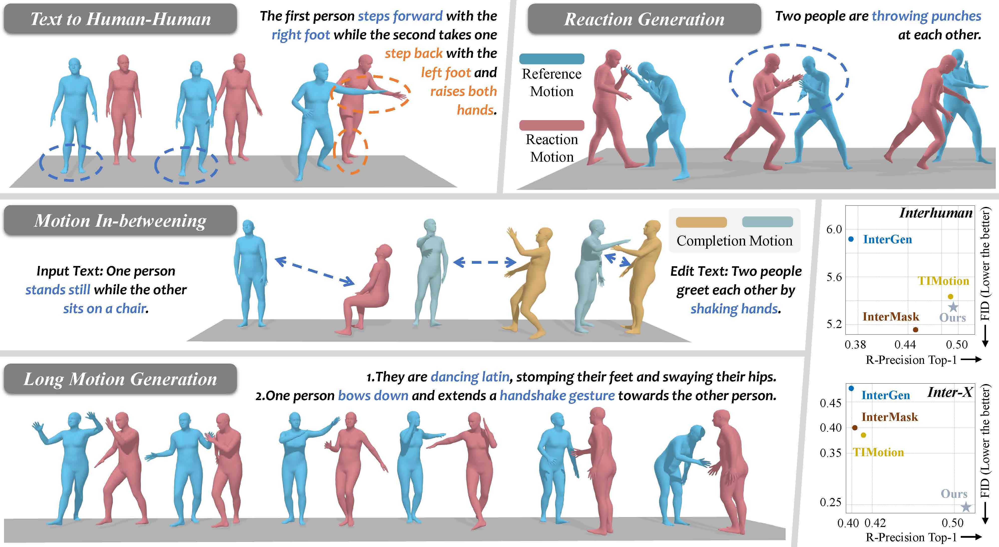

# InterDist: Generating Distance-Aware Human-to-Human Interaction Motions From Text Guidance

### [Paper](https://ieeexplore.ieee.org/document/11342399) | [InterHuman Dataset](https://drive.google.com/drive/folders/1oyozJ4E7Sqgsr7Q747Na35tWo5CjNYk3?usp=sharing) | [Inter-X Dataset](https://github.com/liangxuy/Inter-X)



## Overview

InterDist is a text-guided model for generating human-to-human interaction motions. It explicitly models the distance between two bodies to produce two-person motion sequences that are better coordinated in semantics, movement, and interaction distance.

The model uses a two-stage training pipeline:

1. Train the VQ-VAE to encode continuous human motions and interaction distances into discrete representations.
2. Train the InterDist Transformer to predict discrete motion representations from text conditions, then decode them with the VQ-VAE to obtain human-to-human interaction motions.

The testing stage includes VQ-VAE motion reconstruction evaluation and text-to-interaction motion generation evaluation on the InterHuman and Inter-X datasets.

## Framework Implementations

This project provides two implementations:

| Framework | Directory | Description |
| --- | --- | --- |
| Jittor | [`jittor_code/`](jittor_code/) | Implementation based on the open-source machine learning framework [Jittor](https://cg.cs.tsinghua.edu.cn/jittor/) |
| PyTorch | [`pytorch_code/`](pytorch_code/) | PyTorch implementation |

We recommend using the **Jittor implementation** first. Jittor is an open-source deep learning framework with dynamic graphs, just-in-time compilation, and GPU acceleration. We welcome its use and improvement in research and engineering to help advance the open-source deep learning ecosystem.


## Training and Evaluation

Choose a framework and run the commands from its corresponding directory. Both the [Jittor implementation](./jittor_code/README.md) and the [PyTorch implementation](./pytorch_code/README.md) cover the following workflow:

1. Configure the runtime environment and prepare the InterHuman or Inter-X dataset.
2. Download the pretrained models for the selected framework.
3. Train the VQ-VAE.
4. Train the InterDist Transformer using the VQ-VAE weights.
5. Evaluate VQ-VAE reconstruction quality or text-guided motion generation results.


## Reference Results

The main results of the original model on the text-to-interaction motion generation task are shown below:

| Dataset | FID | Diversity | TOP1 | TOP2 | TOP3 | Matching | Multi |
| --- | ---: | ---: | ---: | ---: | ---: | ---: | ---: |
| InterHuman | 5.296 | 7.961 | 0.492 | 0.652 | 0.732 | 3.774 | 0.753 |
| Inter-X | 0.245 | 9.382 | 0.511 | 0.707 | 0.806 | 3.175 | 1.290 |

Actual results may vary slightly depending on hardware, random seeds, and dependency versions.


## Citation

If this project is useful for your research, please cite:

```bibtex
@article{zhang2026interdist,
    author={Zhang, Jia-Qi and Wang, Jia-Jun and Zhang, Fang-Lue and Wang, Miao},
    journal={IEEE Transactions on Visualization and Computer Graphics},
    title={Generating Distance-Aware Human-to-Human Interaction Motions From Text Guidance},
    year={2026},
    volume={32},
    number={3},
    pages={2615-2627},
    doi={10.1109/TVCG.2026.3651382}
}
```

## Acknowledgements

This project is built on the following open-source projects:

- [InterGen](https://github.com/tr3e/InterGen)
- [Inter-X](https://github.com/liangxuy/Inter-X)
- [InterMask](https://github.com/gohar-malik/intermask)
